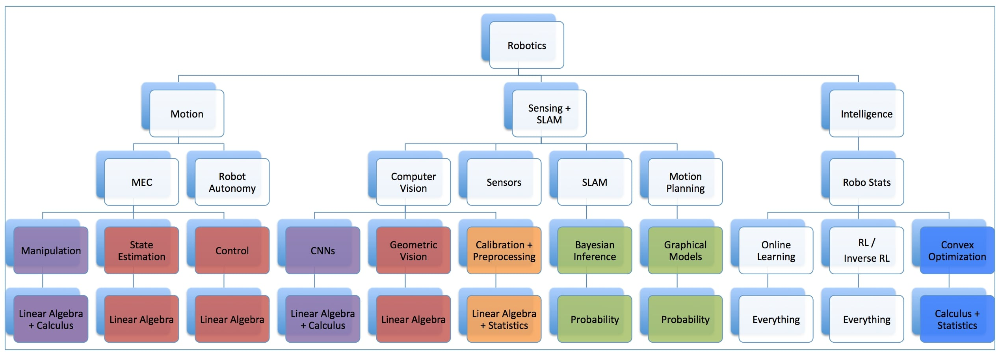

# Robotics Study Program

### Topic Map

#### Requirements
- Ability to program in Python okayishly
- Finish what you take on (don't just start without finishing, you will thank yourself later)
- Don't give up, the world is grateful for what you have to bring to us with your newfound robotics knowledge. Don't give up.

# Theory
## Semester 1 (The core foundations) (60 days):
- [Machine Learning (Stanford CS229)](https://see.stanford.edu/Course/CS229) ML is used a lot because machines can learn to perform tasks better than how we programmers can instruct them to
- [Computer Vision (Carnegie Mellon 16-385)](http://www.cs.cmu.edu/~16385/) Most perception for robots revolves around computer vision, this is crash course to that
- [Manipulation Estimation and Control (Carnegie Mellon (MEC))](https://github.com/lukaeerens93/MEC) Robots need to need to move, know where they are, and control themselves to keep up the good "motion", this is foundational to what comes next

## Semester 2 (Robust to the real world) (100 days)
- [Robot Autonomy (Carnegie Mellon)](https://www.dropbox.com/sh/qj16faks8y4t0jj/AAB5QESVdpy_qsts22J6LkBBa?dl=0) Delves into all core aspects of robot autonomy for strong foundations in grasping, planning, mapping, decision-making etc.
- [Convolutional Neural Networks for Visual Recognition (Stanford CS231n)](http://cs231n.stanford.edu/syllabus.html) Best course on modern day neural net based perception
- [Statistical Methods in Robotics (Carnegie Mellon)](https://www.dropbox.com/sh/fz28miofk05obzm/AAA2IV0LDq4H5e5C-aczPLFza?dl=0) Best introductory course on making robust intelligent robots that have to deal with uncertainty
- [SLAM (Carnegie Mellon)](https://www.dropbox.com/sh/dv84bg2jubs37qi/AAB6R6rQUCD4dnk-R2-Hq2kIa?dl=0) Necessary to instil robots with reliable ability to localize themselves, and map their surroundings in an actionable way

## Semester 3 (Capable of Great Things) (100 days)
- [Geometric Computer Vision (Carnegie Mellon)](https://www.dropbox.com/sh/dv84bg2jubs37qi/AAB6R6rQUCD4dnk-R2-Hq2kIa?dl=0) Deals with projections, homography, epipolar geometry, stereoscopic vision, 3D reconstruction, Calibration
- [Convex Optimization (Carnegie Mellon)](http://www.stat.cmu.edu/~ryantibs/convexopt/) Used to optimize motion of robots like Spot and Atlas from Boston Dynamics to give them smooth, fluid, steady, efficient gaits
- [Deep Reinforcement Learning and Control (Carnegie Mellon)](http://www.andrew.cmu.edu/course/10-703) The future. That doesn't quite work yet. But worth studying nonetheless

## Additional Resources
| Mathematics | Machine Learning | Modern Research Papers | Github Repos |
| ----- | ----- | ----- | ----- |
| [Linear Algebra (3Blue1Brown)](https://www.youtube.com/playlist?list=PLZHQObOWTQDPD3MizzM2xVFitgF8hE_ab) | [Reinforcement Learning (David Silver Deepmind UCL)](https://www.youtube.com/playlist?list=PLqYmG7hTraZDM-OYHWgPebj2MfCFzFObQ) | [Arxiv Sanity](http://www.arxiv-sanity.com/top) | [Python Robotics Algo Implementations](https://github.com/AtsushiSakai/PythonRobotics) |
| [Calculus (3Blue1Brown)](https://www.youtube.com/playlist?list=PLZHQObOWTQDMsr9K-rj53DwVRMYO3t5Yr) | [Advanced Deep Learning and Reinforcement Learning](https://www.youtube.com/playlist?list=PLqYmG7hTraZDNJre23vqCGIVpfZ_K2RZs) | [Github Summaries of Major Research Papers](https://github.com/aleju/papers) | [Practical notebooks for Khipu 2019](https://github.com/khipu-ai/practicals-2019) |
| [Probability (Khan Academy)](https://www.khanacademy.org/math/ap-statistics/probability-ap) | [OpenAI Spinning Up RL Tutorials](https://spinningup.openai.com/en/latest/index.html) |  | [RL an Intro (all code implementations of book)](https://github.com/ShangtongZhang/reinforcement-learning-an-introduction) |
| [Statistics (Khan Academy)](https://www.youtube.com/playlist?list=PL1328115D3D8A2566) |  | |

